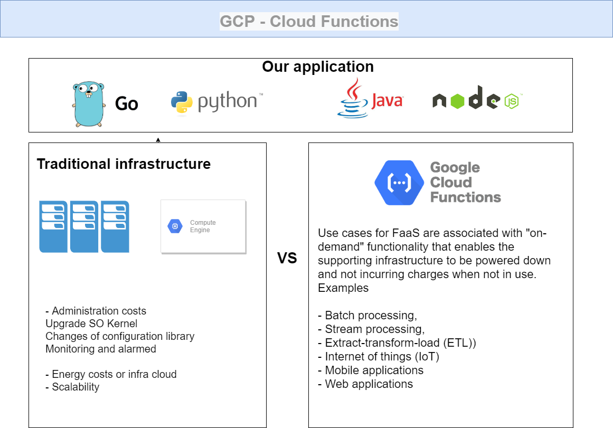
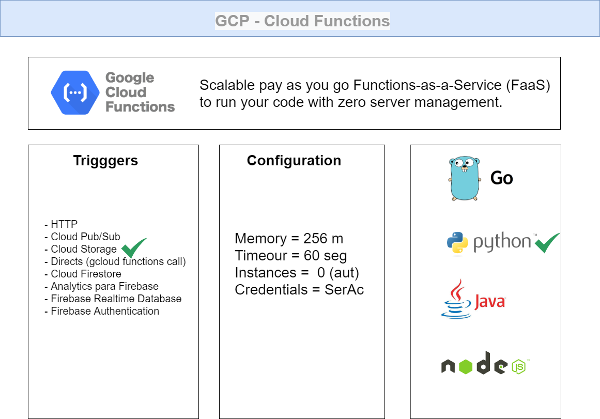
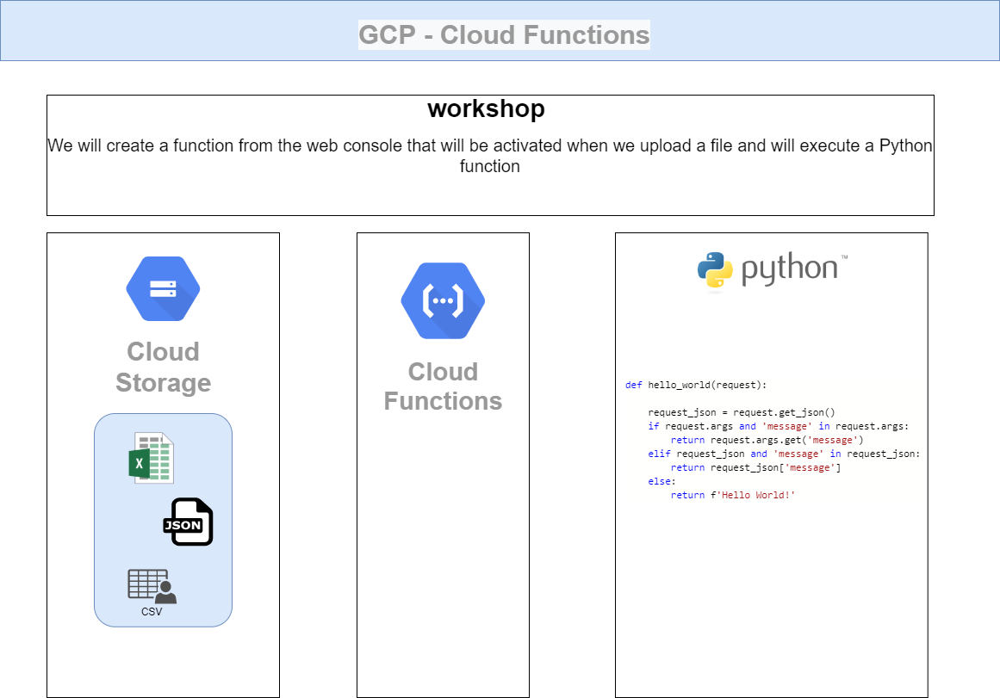

### Introduction to Functions Google Cloud 

Basic introduction on functions oriented to the final objective that will be presented in the next videos that deals with a complete workflow with Python and Google Cloud.
We will start as a function and for what we will use, we will talk superficially about other uses that can be given to the functions.

### Long term goals

### Workfow 

We will create a function from the web console that will be activated when we upload a file and will execute a Python function

´´´
def hello_world(request):
    
    request_json = request.get_json()
    if request.args and 'message' in request.args:
        return request.args.get('message')
    elif request_json and 'message' in request_json:
        return request_json['message']
    else:
        return f'Hello World!'
´´´

### Documentation 

https://cloud.google.com/functions?hl=es-419
https://cloud.google.com/functions/pricing?hl=es-419
