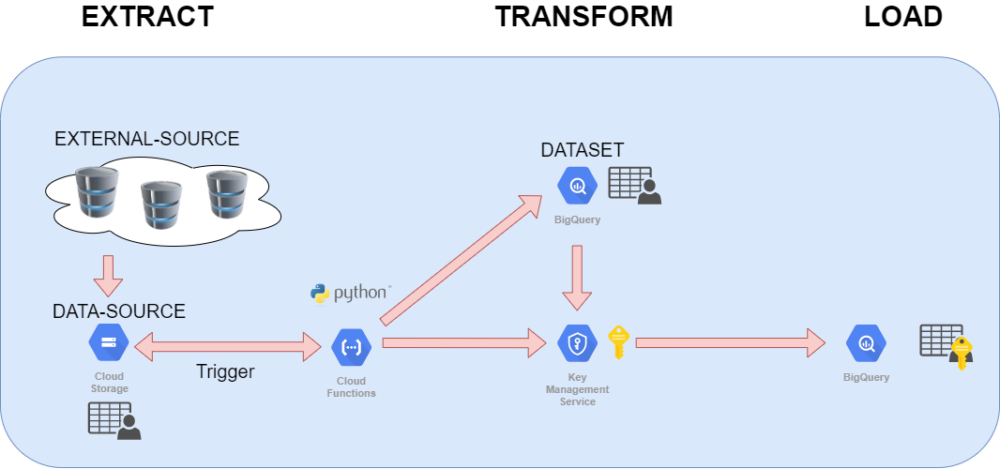
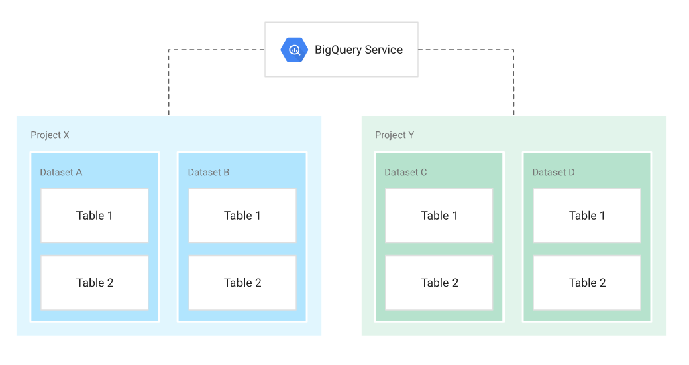
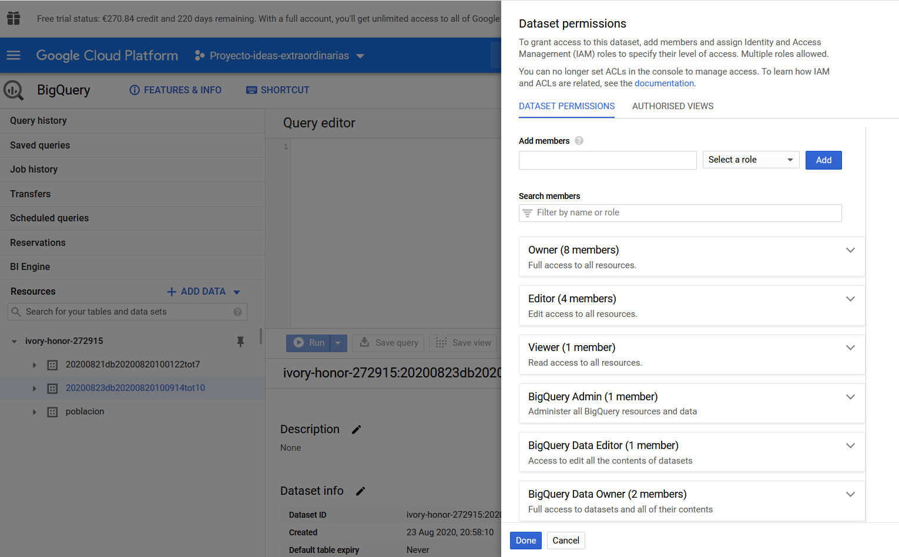
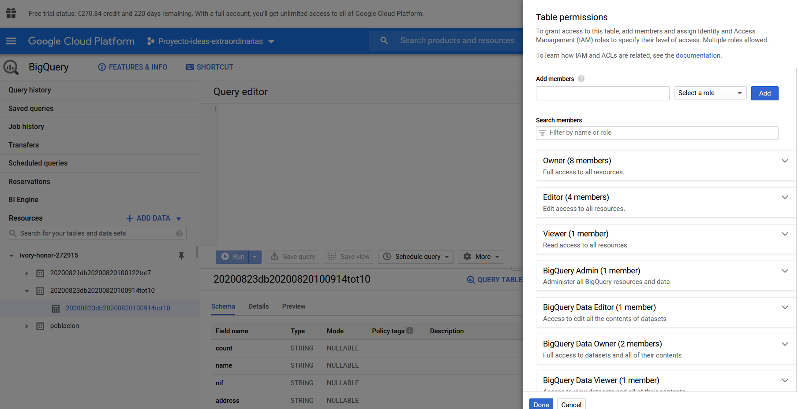
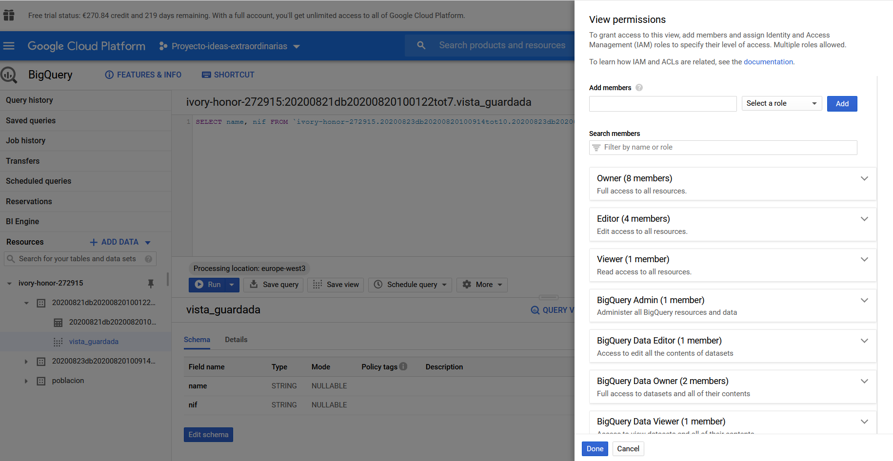

# GCP_Workflow ETL 

In this video, we will see why create a workflow in Google Cloud to run when a file is uploaded to the bucket.
We will convert the information into a data set.
We will transform part of the information in the data set for anonymization or segmentation, to avoid the following risks:
    a. Known existing re-identification risks
    b. Potential re-identification risks
    c. Unknown risks

We will load the dataset again so that it is available for consumption.


### Long term goals




### Introduction to BigQuery

Storing and querying massive datasets can be time consuming and expensive without the right hardware and infrastructure. BigQuery is an enterprise data warehouse that solves this problem by enabling super-fast SQL queries using the processing power of Google's infrastructure. Simply move your data into BigQuery and let us handle the hard work. You can control access to both the project and your data based on your business needs, such as giving others the ability to view or query your data.

You can access BigQuery by using the Cloud Console or the classic web UI, by using a command-line tool, or by making calls to the BigQuery REST API using a variety of client libraries such as Java, .NET, or Python. There are also a variety of third-party tools that you can use to interact with BigQuery, such as visualizing the data or loading the data.

### Big Query structure 





### Big Query Security

It is very important to have different levels of security.











### Commands to work with Workspaces

```
LINUX 
export GOOGLE_APPLICATION_CREDENTIALS="../credentials/credentials.json"
```


### Function: function_create_dataset_big_query

In folder must be the Python file with the root function.
It must have the same name with which we created the function.
We can also use the file "requirements.txt" with the list of libraries to install.

```
gcloud functions deploy create_dataset_and_table_bq --runtime python38 --region europe-west3 --trigger-resource "big-data-poblacion" --trigger-event google.storage.object.finalize
```

### Function: create_dataset_and_table_and_move_data

```
gcloud functions deploy create_dataset_and_table_and_move_data_bq --runtime python38 --region europe-west3 --trigger-resource "big-data-poblacion" --trigger-event google.storage.object.finalize
```


### Function: create_dataset_and_table_and_move_data_with_sql_query_bq

```
gcloud functions deploy create_dataset_and_table_and_move_data_with_sql_query_bq --runtime python38 --region europe-west3 --trigger-resource "big-data-poblacion" --trigger-event google.storage.object.finalize
```

### Function: create_dataset_and_table_and_move_data_with_transformations

```
gcloud functions deploy create_dataset_and_table_and_move_data_encrypt_bq --runtime python38 --region europe-west3 --trigger-resource "big-data-poblacion" --service-account "ideas-functions-video@ivory-honor-272915.iam.gserviceaccount.com" --trigger-event google.storage.object.finalize
```


### Debug Big query 

- We will take a id number job, for example ivory-honor-272915:US.1bed0e42-2369-4cc3-b841-35d95081516d
- Open Cloud shell, and run command 

```
bq show -j ivory-honor-272915:US.1bed0e42-2369-4cc3-b841-35d95081516d
```
- We will see more information to debbug a problem


Solution: the data set had a line break
its ko 
```
"2","Valentina Gámez Lledó","X9945664G","Ronda Rosalinda Cisneros 931\nCastellón, 27573","cp: 97445","#c13a67","+34730115820","091-96-6193","count_bank: ES0741754813682268492448"
```
its ok
```
"2","Valentina Gámez Lledó","X9945664G","Ronda Rosalinda Cisneros 931Castellón, 27573","cp: 97445","#c13a67","+34730115820","091-96-6193","count_bank: ES0741754813682268492448"
```

### Documentation 

https://cloud.google.com/bigquery/docs/loading-data-cloud-storage-csv?hl=es
https://cloud.google.com/kms/docs/encrypt-decrypt
https://cloud.google.com/bigquery/streaming-data-into-bigquery
https://cloud.google.com/bigquery/docs/best-practices-costs
https://cloud.google.com/bigquery/docs/pandas-gbq-migration
https://cloud.google.com/bigquery/docs/managing-table-schemas?hl=es-419
https://towardsdatascience.com/apply-and-lambda-usage-in-pandas-b13a1ea037f7
https://note.nkmk.me/en/python-pandas-list/
https://cloud.google.com/bigquery/docs/dry-run-queries
https://cloud.google.com/bigquery/quotas#query_jobs
https://cloud.google.com/bigquery/docs/error-messages

#### Recommended reading 
https://www.aepd.es/sites/default/files/2019-09/guia-orientaciones-procedimientos-anonimizacion.pdf

### Error

google.api_core.exceptions.NotFound: 404 POST https://bigquery.googleapis.com/bigquery/v2/projects/ivory-honor-272915/jobs: Not found: Dataset ivory-honor-272915:ivory-honor-272915:poblacion

google.api_core.exceptions.BadRequest: 400 Error while reading data, error message: CSV table encountered too many errors, giving up. Rows: 1; errors: 1. Please look into the errors[] collection for more details.